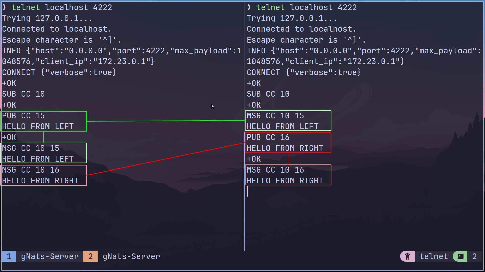
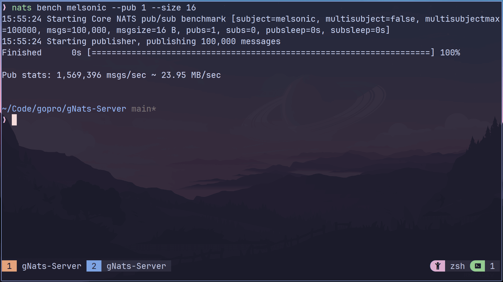

### gNats Server

#### Features

- The following commands are supported
  - `CONNECT`
  - `PING`
  - `SUB`
  - `PUB`
  - `UNSUB`

#### Run the application

- First clone the project
  - `https://github.com/melsonic/gNats-Server.git && cd gNats-Server`
- Run the project
  - `make`
- If you have Docker installed, you can also run it as a Docker container.
  - `docker compose up`
- After the Application is up and running, it's time to test the application
  - Run `telnet localhost 4222` to connect a client to the server

#### Output

- Scenerio: Two clients subscribed to the same subject
   
   
  
   

- Here is the output of `nats bench` tool publishing **1 Million** messages of
  size 16 byte each.
   
   
  
   

#### Learnings & Notes

- `conn.Read()` returns `io.EOF` when client signals graceful end of input i.e
  no more reading. Not closing the connection on `io.EOF` will result into
  infinite loop(infinite zero byte reading from the pipe)
- `INFO{}` should send `payload`, else by default it sends 0 & results in
  `maximum payload exceeded error`.
- `zero allocation byte parser` parsing method
  - It can be used to optimize storage. Normally, storage is required to store
    the parsed tokens. But in this method the parser changes `state` and based
    on current state and next byte, it takes relevant actions.
- `nats bench` sends `CONNECT {"verbose":false,...}`, so the application needs
  to parse this verbose arg in order to determine weather to send `+OK` response
  or not. If the application sends `+OK` with `nats bench`, it will result into
  the following error `Expected PONG, got +OK`.
- While dockerizing the application, I faced an error
  `$GOPATH/go.mod exist but should not`, which was due to the fact that in
  `golang` image, the default workdir(`$HOME/go`) is same as
  `$GO_PATH($HOME/go)`. So, it is required to change the `WORKDIR` in the first
  place while building the image.
  - [read-more](https://groups.google.com/g/golang-nuts/c/qEoqkH7M-pk/m/9RZ7LrxcAAAJ).

#### TODO

- [ ] Write Tests
- [ ] Support string subjectId (currently supports only integer subject id)
- [ ] Optimize Unsub Handler (change `[]chan string` to `map[chan]` in
      `subSubscribers map[int][]chan string` for easier removal)
